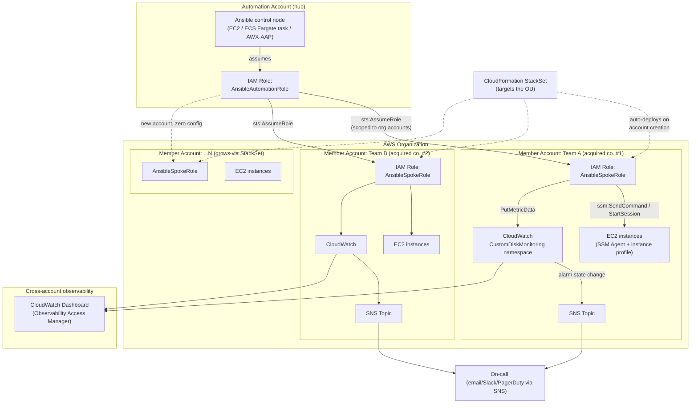

# Architecture

## Request/data flow, step by step

1. **Discovery** (`scripts/generate_account_inventories.py`): running in the hub account, calls `organizations:ListAccounts` to enumerate every member account, then writes one AWS CLI profile (`role_arn` + `source_profile` pointing at `AnsibleAutomationRole`) and one Ansible dynamic-inventory file per account into `inventory/accounts/`.
2. **Inventory**: `ansible-playbook -i inventory/accounts/ ...` loads every file in that directory. Each file's `amazon.aws.aws_ec2` plugin uses that account's profile, which makes boto3 transparently do `AnsibleAutomationRole` → `AnsibleSpokeRole` double-hop assumption, and lists every EC2 instance tagged `Monitoring: disk`.
3. **Connect**: Ansible connects to each discovered instance via `community.aws.aws_ssm` -- no SSH keys, no bastion host, no inbound port opened on the instance. Every action is authenticated as the assumed `AnsibleSpokeRole` session and logged in that account's CloudTrail.
4. **Collect**: the `disk_monitor` role's `setup` module gathers `ansible_facts.mounts` on the instance (already part of normal fact-gathering, no extra remote execution). Used-percent is computed in Ansible, not on the instance.
5. **Publish**: the control node (not the instance) calls `cloudwatch:PutMetricData` using the same assumed-role session, publishing per-instance/per-mount metrics plus one per-account rollup metric.
6. **Alarm**: one warning + one critical CloudWatch alarm per account watches the rollup metric and notifies an SNS topic.
7. **Present**: CloudWatch's cross-account observability (Observability Access Manager) rolls every account's metrics into one dashboard in a designated monitoring account, without copying data or granting broad cross-account read access.
8. **Scale**: a new acquired company's AWS account is invited into the Organization and placed in the monitored OU. The CloudFormation StackSet targeting that OU deploys `AnsibleSpokeRole` into it automatically. The next scheduled run of `generate_account_inventories.py` discovers it. No human touches Ansible config, IAM policy, or the dashboard.

## Why SSM instead of SSH

| | SSH (traditional) | SSM (this design) |
|---|---|---|
| Inbound ports | 22 open somewhere reachable | None -- agent-initiated outbound only |
| Credentials | Keypairs to generate, distribute, rotate, revoke per account | None persistent -- IAM + short-lived STS sessions |
| Cross-account | A jump host / VPN per account, or shared keys (bad practice) | Native: one IAM trust chain, no network path needed at all |
| Audit trail | Depends on host-level logging | Every session/command in CloudTrail centrally |
| Bastion/jump host to maintain | Yes | No |

## Scheduling the control plane

Options, in increasing order of operational maturity:

1. **Cron on a control-node EC2 instance** -- simplest, adequate for the assignment's scope.
2. **EventBridge Scheduler → ECS Fargate task** -- serverless, no always-on instance; the task assumes `AnsibleAutomationRole` via its task role and runs the same playbook. Scales by running one task per account/region in parallel instead of a single long serial run.
3. **AWX / Ansible Automation Platform** -- if the "existing stack" already includes it, register this repo as a Project, the generated inventory directory as an Inventory source (refreshed on a schedule), and `monitor_disk.yml` as a Job Template on a cron schedule. Gains RBAC, run history, and multiple execution nodes for parallelism as the fleet grows, without changing anything in this repo.

## Known limitations / what a production rollout adds next

- SNS topics/subscriptions per account are referenced (`sns_topic_arn` in `group_vars/all.yml`) but not provisioned by this repo -- would add a small CloudFormation/Ansible piece per account, deployed by the same StackSet as the spoke role.
- No secrets are stored anywhere in this design (that's the point of the SSM/assumed-role approach) -- the one credential that does exist, the hub's initial IAM user/role bootstrap, should be backed by SSO/Identity Center in a real rollout rather than a static IAM user.
- The per-account rollup metric (`DiskUsedPercentFleetMax`) trades granularity for alarm scalability -- investigating *which* instance breached still means reading the dashboard's detailed metrics, not the alarm notification alone. A future iteration could enrich the SNS message via a small Lambda that queries the detailed metrics at alarm time and includes the offending instance ID in the notification text.
- Windows instances need `ansible_shell_type: cmd` / PowerShell fact-gathering equivalents -- this repo's `ansible_facts.mounts` path is Linux-oriented; Windows disk collection would use `ansible.windows.win_disk_facts` instead, same publish/alarm logic downstream.
